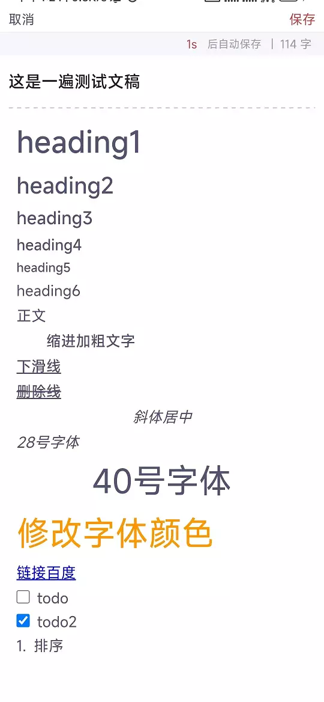

## wangEditor-Android

基于[**wangEditor**](https://github.com/wangeditor-team/wangEditor) 在Android实现的富文本功能

## 支持的功能 Supported Functions

- [X] Bold
- [X] Italic
- [X] Subscript
- [X] Superscript
- [X] Strikethrough
- [X] Underline
- [X] Justify Left
- [X] Justify Center
- [X] Justify Right
- [X] Heading 1、2、3 、4、5、6
- [X] Undo
- [X] Redo
- [X] Indent
- [X] Outdent
- [X] Blockquote
- [X] Code, 如果是设置选择文本使用code，会清除其他格式只保留文本
- [X] Insert Image
- [X] Insert Video
- [ ] Insert Audio : 编辑器不支持~，如果同js的人可以扩展一下
- [X] Insert Link
- [x] Checkbox：【Todo】
- [X] Text Color
- [X] Text Background Color
- [X] Text Font Size
- [X] Unordered List (Bullets)
- [X] Ordered List (Numbers)
- [X] Cursor Color 光标颜色 ，和 Android光标下的小圆点按钮颜色是通过主题修改的
- [X] removeFormat 清除选中文本的格式，不可以清除heading
- [ ] Table :编辑器支持，后面可以看情况加入，感觉手机上可能用不到

|                        |     |
|------------------------|-----|
|  |      |
|  |      |

## Default Setting for Editor

### Height

``` 
editor.setEditorHeight(200);  //dp = html px
```

### Font

``` 
editor.setEditorFontSize(22);  //android dp = html px
editor.setEditorFontColor(Color.RED);
```

### Background

``` 
editor.setEditorBackgroundColor(Color.BLUE);
```

### Padding

``` 
editor.setPadding(10, 10, 10, 10); //android dp = html px
```

## 键盘监听

`initKeyboardChange`，可以自行重写使用

> 主要是为了修复打开键盘的时候，无法自动滚到选中的位置

默认实现操作：

- 打开键盘时滚动到当前选中位置或者上一次选中的位置
- 关闭键盘时，清除焦点

## 工具栏实现

```XML

<com.wangeditor.android.toolbar.RichEditorToolbar 
    android:id="@+id/editToolbar" 
    android:layout_width="match_parent"
    android:layout_height="wrap_content" />
```

```Kotlin
editToolbar.setEditor(mViewBinding.richEditor)
editToolbar.initTextStyle()
editToolbar.initFunStyle()
editToolbar.initParagraphStyle()
editToolbar.initMedia()
```

1. 可以自己选择添加对应工具，也可以自己自定义item,item的view可以自己决定是Textview/Imageview/ViewGroup
2. 可以添加多个toolbar 控制一个editor

## 链接项目

- API参考项目：[richeditor-android](https://github.com/wasabeef/richeditor-android)

- 核心内容：[wangeditor](https://www.wangeditor.com/v5/API.html)

## 修改Android System WebView

> wangEditor不支持低版本的Chrome，如果主要用户群体是消费水平低的人的话，不建议使用这个库

> 为什么不用X5，1. X5是动态加载的，内核由于包大小较大，存在一定失败率，也就是说用户可能会存在无法使用的情况
> 2.如果你要上架google，那么就不能使用X5


[android-system-webview.APK](https://www.apkmirror.com/apk/google-inc/android-system-webview/android-system-webview-89-0-4389-90-release/android-system-webview-89-0-4389-90-3-android-apk-download/?redirected=thank_you_invalid_nonce)

## 相关提示说明

1. 其中的交互部分`wang_app_editor.js`可以在iOS上通用，就是说iOS可以复制使用相关功能，不过可能需要修改部分调用native的方法部分。

2. 为什么项目中没有使用原生Span实现，主要原因是标签解析的问题。
   原生我也实现了一版demo，大部分功能都已实现,发现中间会有很多意外的情况需要进行处理。

3. 为什么使用`wangEditor`，  这是考虑多端处理的结果，其中web端使用了`wangEditor`项目进行开发的，我尝试移植后发现也可以使用，这样可以保证相同的格式处理问题。

4. wangEditor`功能很全，但是我只懂皮毛的`js`和`html`，所以我这里只用到**部分**的功能，也有一些功能被我移除了,我用的是`simple

5. > mode: 'default' 默认模式 - 集成了`wangEditor`所有功能
   >
   > mode: 'simple' 简洁模式 - 仅有部分常见功能，但更加简洁易用

6. > 缺点：`wang_editor_index.js`体积太大，功能内容太多，已我的知识储备无法进行优化简化,同时不支持低版本chrome
   >
   > 优化：`wangEditor`功能齐全强大，后续可以功能同步web