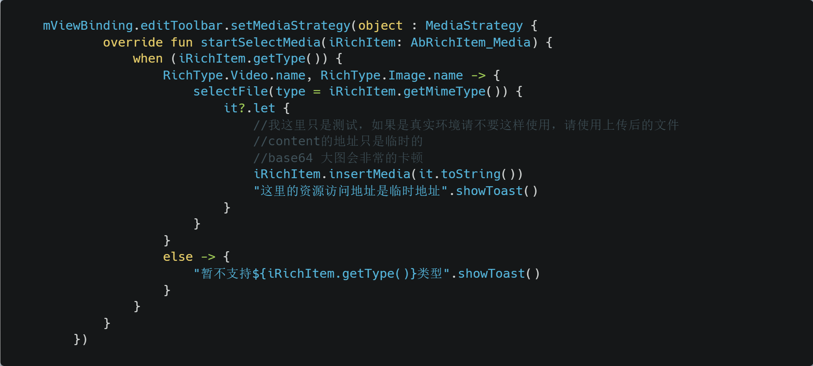

## 二、RichEditorToolbar

- setEditor * (必须执行)
- addItem
- addItems
- onKeyboardHide
- onKeyboardShow
- performClickItem
- removeItem
- removeItems
- setMediaStrategy (媒体类型按钮点击的代理)

## Media 媒体文件处理
1. 建议自己使用上传后的url,使用本地的地址可能存在被删除的情况，并且`content://`类型是会变的
2. 可以base64，但是稍大一点的图片就会卡顿，暂时没有好的优化条件
